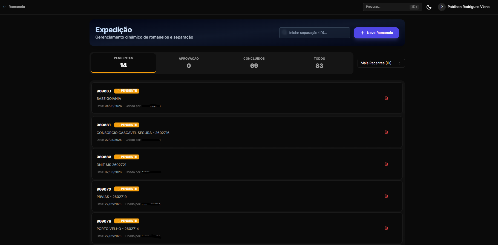
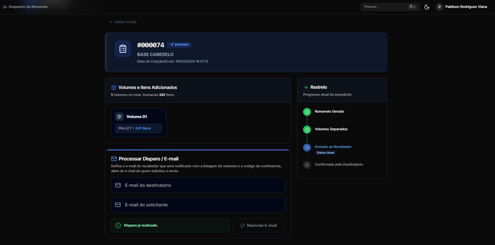
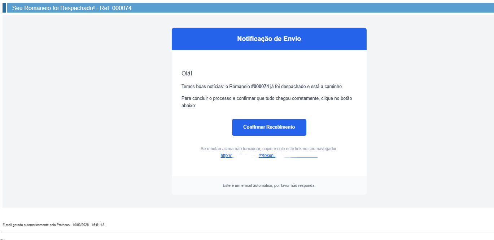
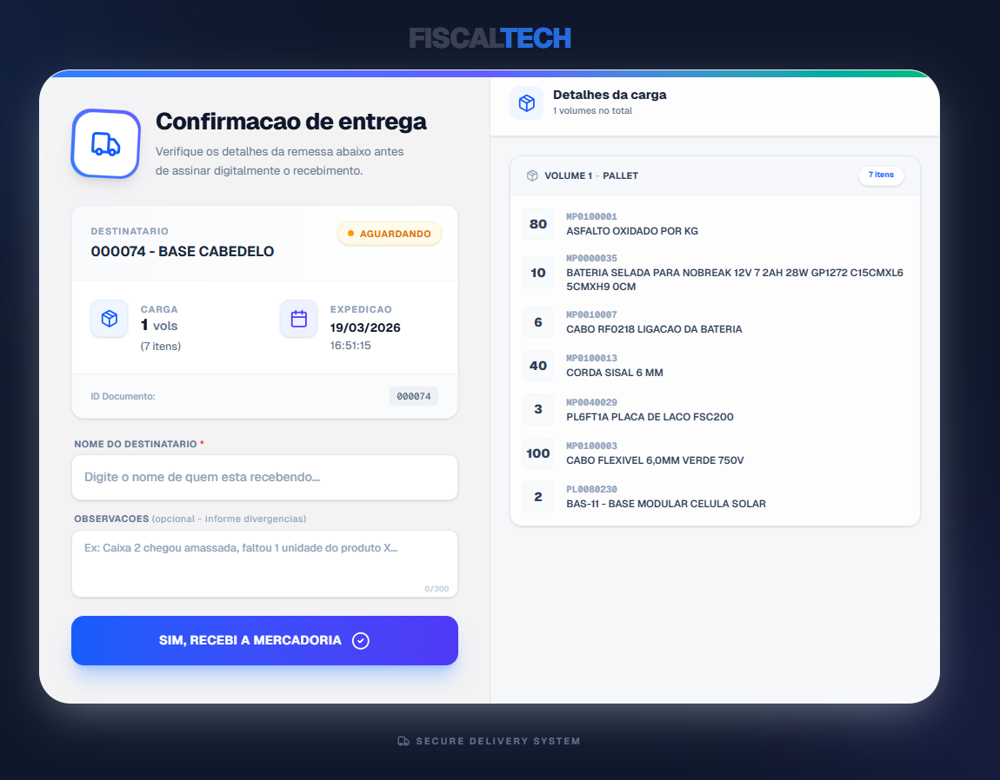

# FiscalTech Tracking App

Portal web para consulta e confirmação de recebimento de romaneios, com integração server-side com o Protheus.

---

## Fluxo do Processo

Este sistema permite o acompanhamento do romaneio desde a criação até a confirmação final do recebimento, garantindo rastreabilidade e segurança com validação por token. O processo é composto pelas seguintes etapas:

1. **Criar/Separar Romaneio:** É gerado o romaneio e realizada a separação dos itens.
   
   

2. **Despacho do Romaneio:** Após separação, registra-se o despacho ao destinatário, notificando seu e-mail.
   
   

3. **Notificação por E-mail:** O destinatário recebe um e-mail com um token único para confirmação.
   
   

4. **Confirmação de Recebimento:** O destinatário acessa a tela, valida os itens recebidos, confirma e o token é apagado (prevenindo duplicidade de confirmação).
   
   

---

## Demonstração do Funcionamento

- O romaneio criado fica visível na tela de expedição, facilitando a gestão dos pendentes e concluídos.
- Após despacho, o destinatário recebe e-mail contendo um token exclusivo.
- O destinatário confirma a entrega, verificando os itens e, caso necessário, informa divergências.
- Ao confirmar, o token é invalidado, não permitindo novas confirmações para aquele envio.

---

## Stack

- Next.js 16 (App Router)
- React 19
- TypeScript
- Tailwind CSS 4
- API Rest
- Sql Server

---

## Executando localmente

1. Configure as variáveis no arquivo `.env.local`:

   ```env
   PROTHEUS_REST_URL=http://seu-servidor:8087/rest
   PROTHEUS_REST_USER=usuario
   PROTHEUS_REST_PASS=senha
   ```

2. Inicie o projeto:

   ```bash
   npm run dev
   ```

3. Acesse `http://servidor?token=SEU_TOKEN`.

---

## Estrutura do Projeto

```text
app/
  api/
    confirm/route.ts     -> confirma o recebimento
    romaneio/route.ts    -> consulta os dados do romaneio
  layout.tsx             -> layout e metadata da aplicação
  page.tsx               -> ponto de entrada da página

components/receipt/
  ...                    -> componentes visuais da jornada de confirmação

hooks/
  use-receipt-flow.ts    -> estado e fluxo da tela principal

lib/
  server/                -> integração com Protheus
  types/                 -> contratos do domínio
  utils/                 -> utilitários puros
```

---

